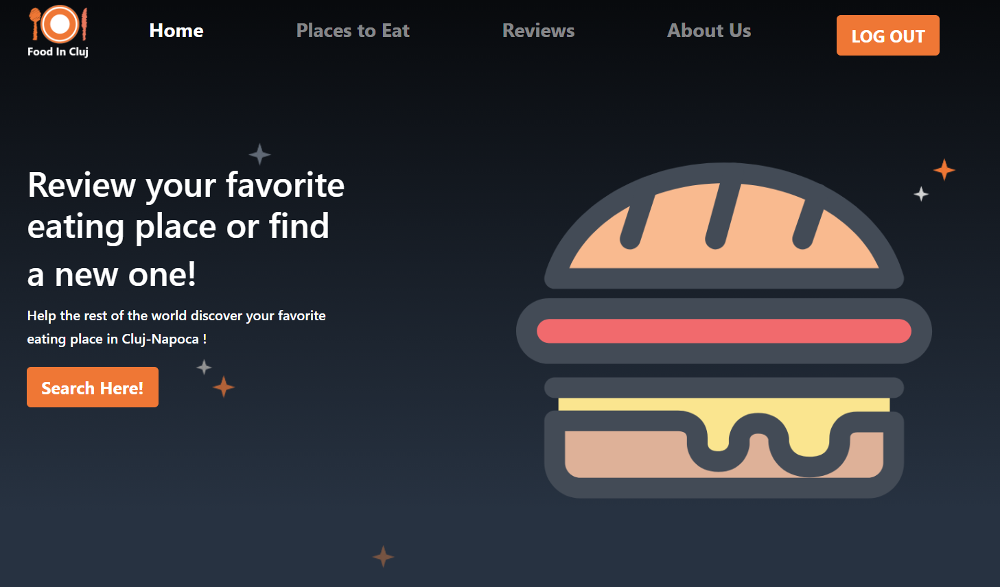
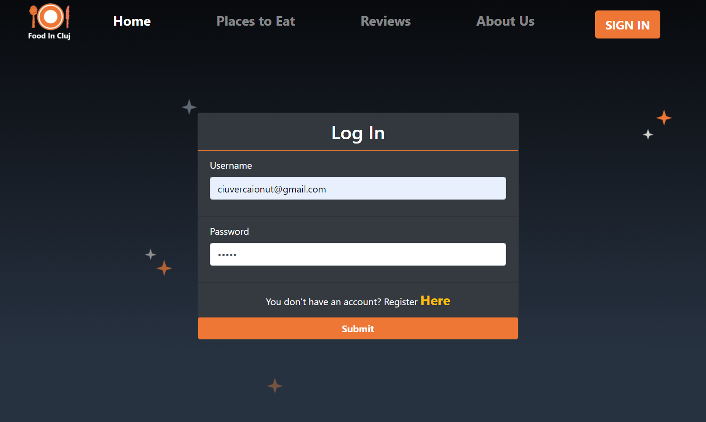
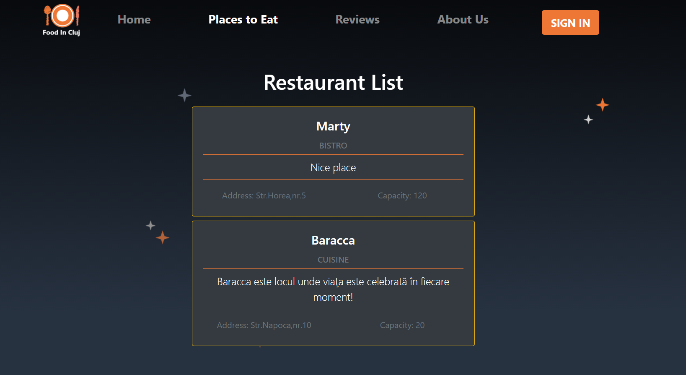
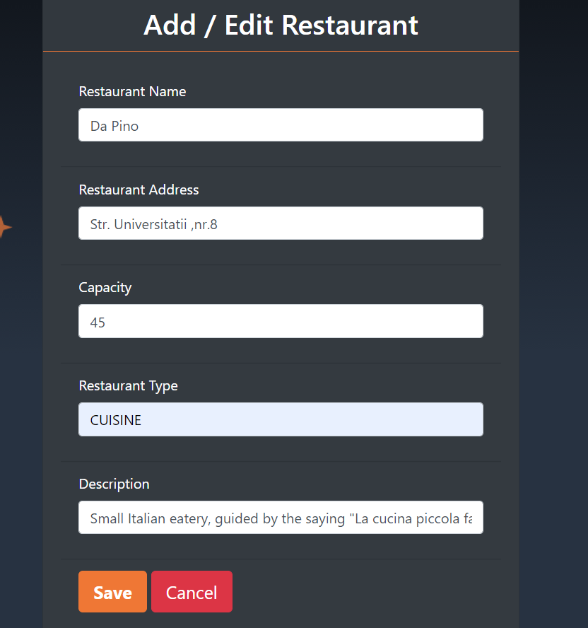
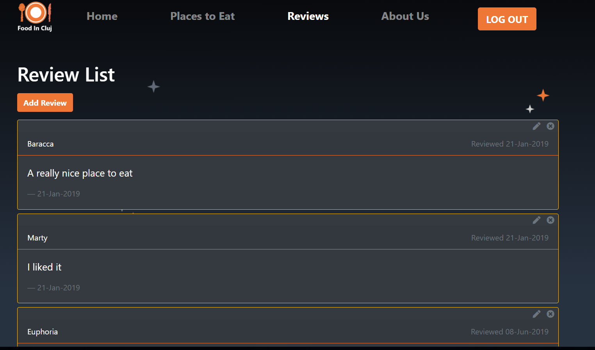
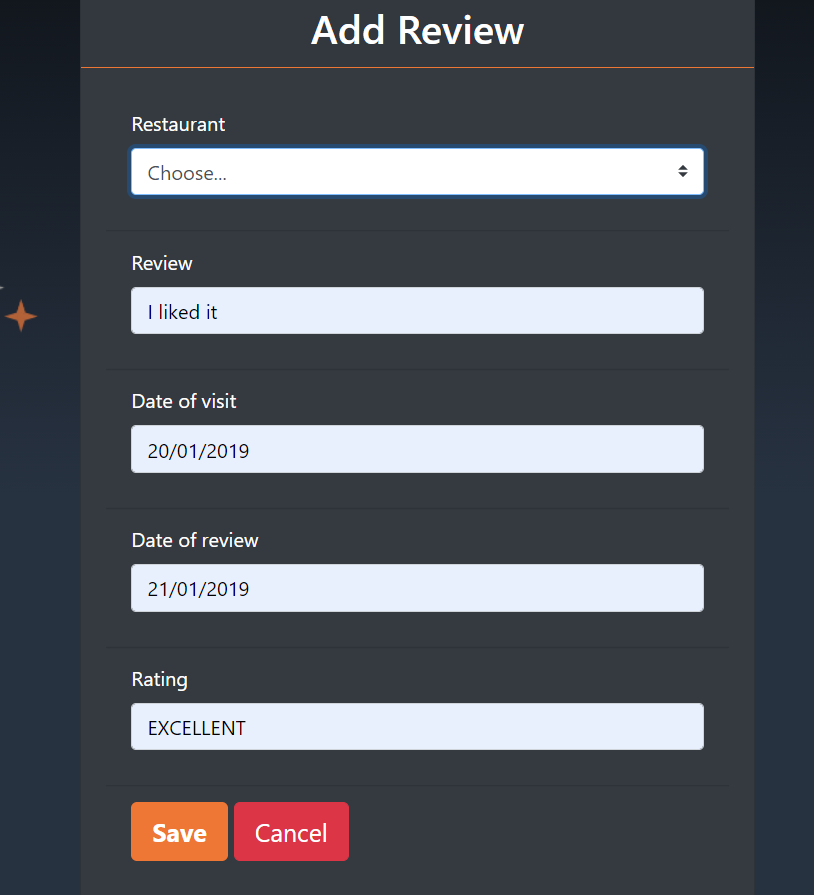
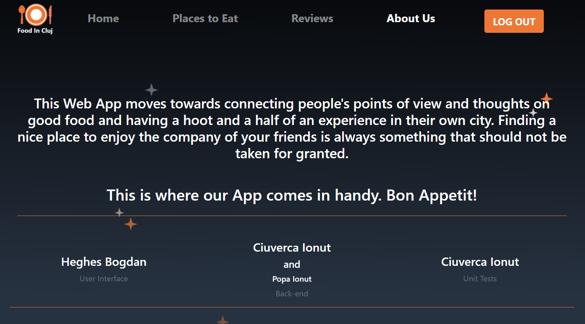

# RestsInCluj  

This Web App moves towards connecting people's points of view and thoughts on good food and having a hoot and a half of an experience in their own city. Finding a nice place to enjoy the company of your friends is always something that should not be taken for granted.
                                    This is where our App comes in handy. Bon Appetit!
                                    
This application stared as a final project for the Java Development course of The Informal School of it and up to a presentation it was developed by 3 students and now I'm working alone on it.

We used:
1. Spring Boot
2. PostgresSQL
3. JDBC
4. RestAPI
5. Thymeleaf
6. JUnit
7. Mokito

# Images

  --- Home Page ---       

 --- Register form ---    

  
     
 --- Login form ---    

  
  
  --- Places to eat ---     

  --- Add/Edit Restaurant Form ---    

  --- Reviews ---     

  --- Add review form ---    

  --- About Us ---    

